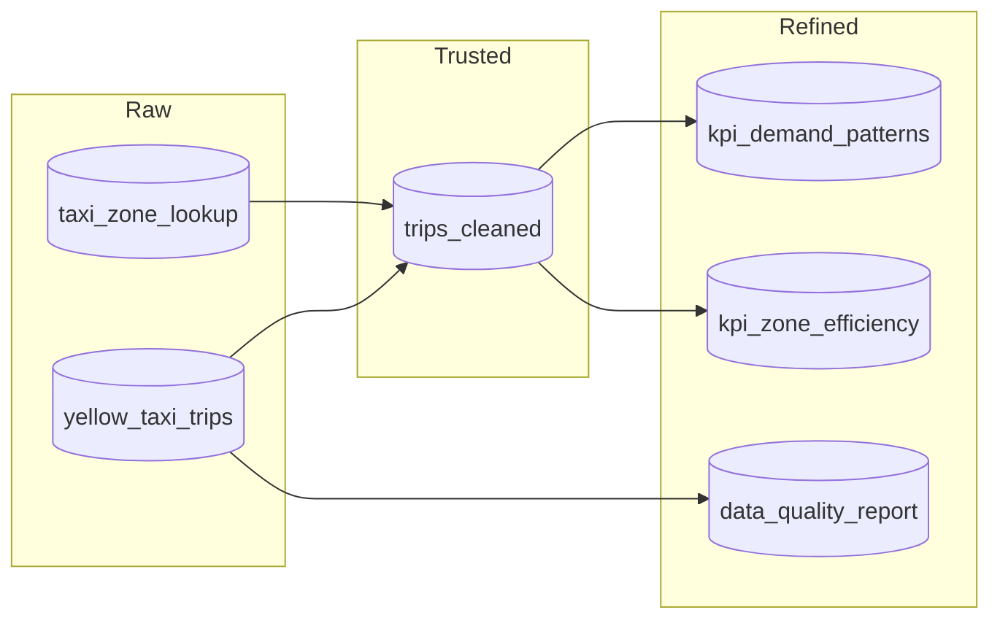

# NYC Taxi ETL Pipeline - Medallion Architecture

Este proyecto implementa un pipeline ETL profesional sobre Azure Databricks para el análisis de viajes de taxis amarillos de Nueva York (Enero 2023).

## Arquitectura Medallion

El pipeline sigue el patrón de diseño Medallion gobernado por **Unity Catalog**:

1.  **Raw Layer**: Ingesta fiel de los archivos Parquet y CSV originales. Almacenamiento en formato Delta con tipado básico.
2.  **Trusted Layer**: Limpieza de datos (fechas consistentes, valores positivos en distancia y tarifa) y enriquecimiento mediante el join con el catálogo de zonas de taxi.
3.  **Refined Layer**: Cálculo de KPIs agregados para toma de decisiones y reportes de calidad de datos.

## Estructura de Unity Catalog

- **Catalog**: `nyc_taxi_<nombre>`
  - **Schema: `raw`**: Tablas `yellow_taxi_trips`, `taxi_zone_lookup`.
  - **Schema: `trusted`**: Tabla `trips_cleaned`.
  - **Schema: `refined`**: Tablas `kpi_demand_patterns`, `kpi_zone_efficiency`, `data_quality_report`.

## Linaje de Datos (Lineage)

## Cómo ejecutar la prueba

## Cómo ejecutar la prueba

1.  **Importar Notebooks**: Sube la carpeta `notebooks/` a tu workspace de Databricks.
2.  **Configuración**: Abre `01_setup.py` y ajusta la variable `user_name` para personalizar tu catálogo en Unity Catalog. Ejecuta todas las celdas.
3.  **Ejecución Secuencial**:
    - Ejecuta `02_raw_layer.py` para descargar e ingestar los datos iniciales.
    - Ejecuta `03_trusted_layer.py` para procesar la limpieza y el join.
    - Ejecuta `04_refined_layer.py` para generar las métricas finales.
4.  **Validación**: Consulta las tablas en el **Catalog Explorer** de Databricks para verificar el linaje y las métricas.

## Decisiones Técnicas Clave

- **Filtrado de fechas**: Se eliminaron registros donde la fecha de recogida es posterior a la de entrega, ya que representan errores de sensor o inconsistencias lógicas.
- **Outliers**: Se filtraron distancias y tarifas <= 0 para asegurar que los KPIs de eficiencia económica (ingreso por milla) sean significativos. No se eliminaron valores extremadamente altos (long trips) para no sesgar el análisis de demanda sin un umbral de negocio definido.
- **Particionamiento**: Para esta prueba de un solo mes, no se aplicó particionamiento adicional. En una carga histórica completa, se recomendaría particionar por `year` y `month`.
- **Unity Catalog**: Se utilizó UC para asegurar la gobernanza, permitiendo un linaje claro y control de acceso granular en el metastore del workspace.

## Limitaciones Conocidas

- La descarga de archivos usa `requests` en el driver, lo cual es apto para archivos de tamaño moderado (~150MB para un mes). Para archivos multiterabyte, se recomendaría usar **Autoloader (CloudFiles)**.
- El manejo de errores es básico (try/except y logs). En producción, se integraría con **Azure Monitor** o **Databricks Workflow Alerts**.
